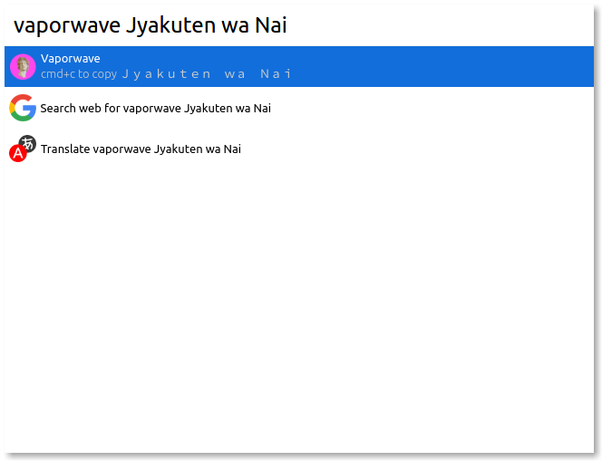

# Cerebro Vaporwave

> Cool text bro but it need more ＶＡＰＯＲＷＡＶＥ

## Usage

In Cerebro, type `vaporwave some text` to generate `ｓｏｍｅ　ｔｅｘｔ`

Use <kbd>cmd+c</kbd> to copy the text.

## Related

* [Cerebro](http://github.com/KELiON/cerebro) – main repo for Cerebro app;

## License

MIT © [Lubien](http://lubien.me)
